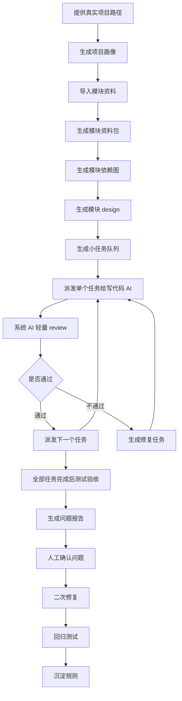

# 使用流程

## 总流程

## 第一步：接入项目

输入：

- 项目路径
- 技术栈说明
- 当前分支
- 运行命令
- 测试命令
- 接口文档路径
- 设计图或 Demo 路径
- 旧项目参考路径

输出：

- 项目画像
- 项目扫描清单
- 项目规则提取结果

## 第二步：整理模块资料包

输入：

- 模块名称
- 页面范围
- 路由范围
- PRD
- 接口文档
- 设计图/Demo
- 旧项目参考

输出：

- 模块目标
- 页面清单
- 接口能力矩阵
- 字段映射
- 枚举映射
- 样式参考
- 交互规则
- 待确认问题

## 第三步：生成模块依赖图

需要明确：

- 当前模块依赖哪些模块。
- 当前模块依赖哪些服务。
- 当前模块依赖哪些接口。
- 哪些数据由其他页面创建。
- 当前模块的写操作会影响哪些模块。
- 哪些接口或数据缺失会阻塞本模块。

## 第四步：生成 design 和小任务队列

系统 AI 需要先生成模块 design，再拆出小任务队列。

design 必须说明：

- 模块目标。
- 页面和路由范围。
- 数据流和接口边界。
- 组件拆分建议。
- 状态管理策略。
- 样式参考优先级。
- 测试和验收策略。

每个小任务必须说明：

- 本步骤目标
- 需要改哪些文件
- 复用哪些组件
- 使用哪些接口
- 是否存在不确定项
- 如何验收
- 不允许做什么

小任务必须足够小，写代码 AI 每次只接收一个任务。

## 第五步：系统 AI 派发任务，写代码 AI 执行

系统 AI 执行前必须阅读：

- 项目画像
- 模块资料包
- 模块依赖图
- 模块 design
- 小任务队列
- 阻塞分级规则

系统 AI 不应该把完整模块一次性交给写代码 AI。

写代码 AI 执行前只读取：

- 当前 `task-xx.prompt.auto.md`
- 当前任务要求的必要上下文
- 项目内规则文件

写代码 AI 不应该：

- 一次性完成整个模块。
- 越界修改后续任务的文件。
- 自行猜接口参数。
- 为了跑通而写 mock、关闭 lint/typecheck 或整页 reload。

每个任务完成后，系统 AI 做轻量 review，通过后再派发下一个任务。

## 第六步：测试验收

测试至少包含：

- 代码测试
- 功能测试
- 接口测试
- 样式测试
- 性能测试
- 回归测试

## 第七步：问题确认与二次修复

第一次开发和测试后，大概率会有问题。不要把问题散落在聊天记录里，必须整理为问题卡片。

问题确认后，再进入二次修复。二次修复必须基于问题卡片，不重新猜测需求。

## 第八步：规则沉淀

修复完成后，把可复用经验沉淀为规则，例如：

- 接口文档没定义的参数不能猜。
- 旧项目只参考样式，不照搬接口逻辑。
- 写操作后只刷新相关 query。
- 样式优先级必须提前定义。
