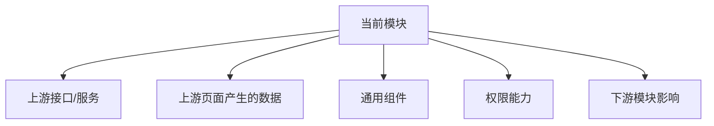

# 模块依赖图模板

> 用途：模块开发前必须整理依赖关系。尤其适合“当前页面依赖其他页面上传/创建的数据”的场景。

## 1. 当前模块

```text
模块名称：
模块路径：
负责人：
```

## 2. 依赖总览

| 依赖对象 | 类型 | 是否阻塞 | 说明 |
| --- | --- | --- | --- |
|  | 页面 / 接口 / 服务 / 数据 / 组件 / 权限 | 是 / 否 |  |

## 3. 上游依赖

上游依赖指：当前模块需要别人提供的数据、接口、配置或页面能力。

| 上游模块/服务 | 依赖内容 | 来源 | 缺失影响 | 处理方式 |
| --- | --- | --- | --- | --- |
|  |  | 接口 / 页面 / 配置 / 上传 / 人工录入 |  |  |

示例：

```text
协议管理依赖 common 文件上传。
商机创建依赖客户精确搜索。
停用代理商依赖商机服务判断是否存在跟进中商机。
```

## 4. 下游影响

下游影响指：当前模块的操作会影响哪些页面或模块。

| 当前操作 | 影响模块 | 影响内容 | 是否需要刷新/联动 |
| --- | --- | --- | --- |
|  |  |  |  |

## 5. 接口依赖

| 接口 | 所属服务 | 当前用途 | 可靠性 | 问题 |
| --- | --- | --- | --- | --- |
|  |  |  | 已稳定 / 可联调 / 不可靠 / 未支持 |  |

## 6. 数据依赖

| 数据 | 由谁产生 | 当前模块如何使用 | 是否有测试数据 |
| --- | --- | --- | --- |
|  |  |  |  |

## 7. 组件依赖

| 组件 | 路径 | 当前用途 | 是否需要新增/扩展 |
| --- | --- | --- | --- |
|  |  |  |  |

## 8. 权限依赖

| 权限点 | 影响页面/操作 | 未授权表现 |
| --- | --- | --- |
|  |  |  |

## 9. 可视化依赖图



## 10. 依赖结论

```text
P0 阻塞依赖：
P1 风险依赖：
P2 优化依赖：
可以先降级处理的依赖：
必须先补齐的依赖：
```

