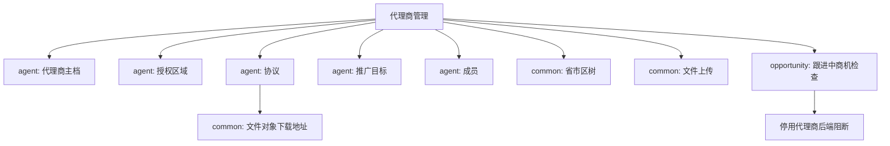

# 模块依赖图：代理商管理

## 1. 依赖总览

| 依赖对象 | 类型 | 是否阻塞 | 说明 |
| --- | --- | --- | --- |
| common 省市区 | 接口/数据 | 是 | 列表筛选和授权区域选择依赖区域树 |
| common 文件上传 | 接口 | 是 | 协议上传依赖文件初始化、直传、完成 |
| common 文件对象 | 接口 | 否 | 协议下载依赖 `fileId` 获取 `downloadUrl` |
| agent 代理商主档 | 接口 | 是 | 列表、详情、新增、编辑、状态变更 |
| agent 授权区域 | 接口 | 是 | 详情授权区块 |
| agent 协议 | 接口 | 是 | 详情协议区块 |
| agent 推广目标 | 接口 | 是 | 详情推广目标区块 |
| agent 成员 | 接口 | 是 | 销售团队、运营团队 |
| opportunity 跟进中商机检查 | 服务依赖 | 否 | 停用代理商由后端检查，不建议前端直接调内部接口 |

## 2. 可视化依赖图



## 3. 上游依赖

| 上游模块/服务 | 依赖内容 | 缺失影响 | 处理方式 |
| --- | --- | --- | --- |
| common | 省市区树 | 授权区域无法选择 | P0，必须可用 |
| common | 文件上传 | 协议无法上传 | P0，必须可用 |
| common | 文件对象 | 协议无法下载 | P1，可记录等待真实数据 |
| opportunity | 是否存在跟进中商机 | 停用代理商校验不完整 | 后端处理，前端只展示错误 |

## 4. 下游影响

| 当前操作 | 影响模块 | 影响内容 | 刷新方式 |
| --- | --- | --- | --- |
| 新增代理商 | 代理商列表 | 新增一行 | invalidate 代理商列表 |
| 编辑代理商 | 代理商列表/详情 | 名称、负责人、财务等 | invalidate 列表和详情 |
| 添加授权 | 代理商列表/详情 | 授权区域摘要 | invalidate 列表和详情 |
| 状态变更 | 代理商列表/详情 | 合作状态 | invalidate 列表和详情 |
| 新增协议 | 详情 | 协议列表 | invalidate 详情 |
| 新增成员 | 详情 | 销售/运营团队 | invalidate 详情 |

## 5. 依赖结论

```text
P0 阻塞依赖：
- agent 主档接口
- common 省市区树
- common 文件上传

P1 风险依赖：
- 代理商列表区级筛选接口未支持
- 文件下载缺真实数据点测
- 部分列表筛选参数后端实现不可靠

可降级处理：
- 区级筛选只提示按省查询
- 停用代理商的跟进中商机检查交给后端错误返回
```

