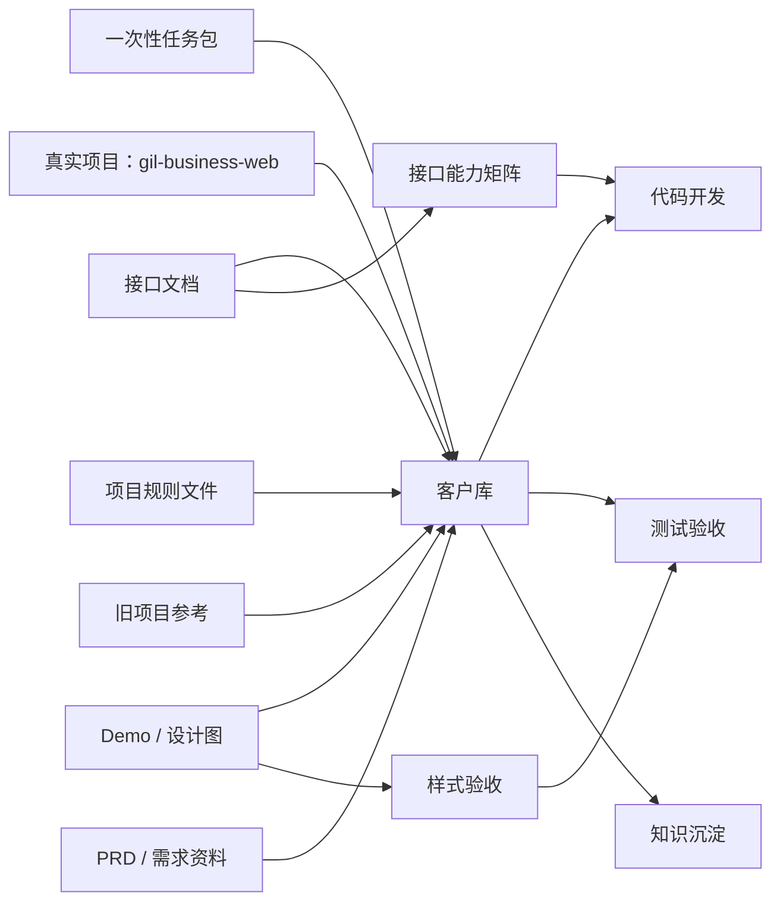

# 客户库 模块依赖图（自动生成）

> 这是自动生成的模块依赖视图，用来帮助 AI 在开发前理解资料、接口、页面和工程依赖。业务依赖需要随着 PRD 和接口补充继续修正。

## Mermaid 依赖图

## 资料依赖

| 类型 | 状态 | 内容 |
| --- | --- | --- |
| 接口文档 | 已提供 | /Users/wangxiaoyu/Desktop/object/gil-business-jiekou/接口文档.md |
| Demo / 设计图 | 已提供 | /Users/wangxiaoyu/Downloads/Demo/商业化管理平台_Demo_V1.0_内部端基础模块.html |
| 旧项目参考 | 已提供 | /Users/wangxiaoyu/Desktop/object/gil-business-web-old/gil-business-web |
| PRD / 需求资料 | 已提供 | 暂无 PRD，按接口文档和 Demo 先生成模块计划。 |

## 工程依赖

| 类型 | 内容 |
| --- | --- |
| 技术栈 | React / Vite / TypeScript / React Router / TanStack Query / Tailwind CSS |
| 关键目录 | src、public、docs |
| 项目规则 | docs/ai-frontend-guide.md、docs/ai-coding-guide.md |
| 可用脚本 | prepare、dev、build、build:test、build:prod、preview、typecheck、lint、lint:fix、format |

## 业务依赖提示

| 依赖 | 原因 | 当前处理方式 |
| --- | --- | --- |
| 客户库 | 可能涉及客户主体、联系人、重复校验或客户详情。接口字段需确认。 | 先记录为待确认，开发时以接口文档和 PRD 为准。 |

## 规则

- 接口文档没有明确支持的能力，不允许前端自行猜参数。
- Demo / 设计图优先于旧项目样式，旧项目只作参考。
- 依赖其他页面产生的数据时，要在测试用例中补充前置数据准备步骤。
- 如果接口或 PRD 不清晰，先记录问题并继续开发可确认部分。
