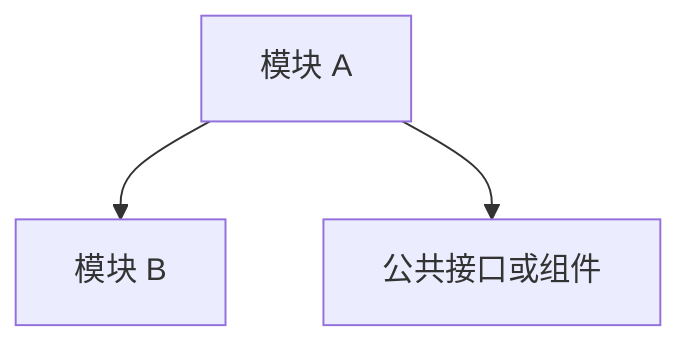

# 模块清单

这个文件记录当前项目要交付的模块，不记录具体代码实现。

## 1. 模块总表

| 模块 | 路由 | 优先级 | 状态 | 负责人 | 依赖 | 备注 |
| --- | --- | --- | --- | --- | --- | --- |
|  |  | P0 | 待分析 |  |  |  |

## 2. 模块拆分标准

一个模块应该能独立分析、独立开发、独立验收。

建议拆分方式：

- 列表页
- 详情页
- 新增/编辑等写操作
- 子资源管理
- 配置页
- 统计页

不建议把整个系统当成一个模块一次性交给 AI。

## 3. 模块依赖关系



## 4. 交付顺序

| 顺序 | 模块 | 为什么先做 | 验收方式 |
| --- | --- | --- | --- |
| 1 |  |  |  |

## 5. 模块风险摘要

| 模块 | 主要风险 | 阻塞等级 | 处理方式 |
| --- | --- | --- | --- |
|  |  |  |  |

## 6. 模块资料包位置

每个模块开始前，建议在项目实例目录下创建：

```text
模块名/
  模块状态卡片.md
  模块资料包.md
  模块依赖图.md
  模块依赖看板.md
  接口能力矩阵.md
  开发步骤卡片.md
  开发进度看板.md
  测试验收.md
  问题追踪看板.md
  规则沉淀.md
```

其中：

- `模块状态卡片.md`：复制 `09-模块看板/模块状态卡片模板.md`
- `模块依赖看板.md`：复制 `09-模块看板/模块依赖看板模板.md`
- `开发进度看板.md`：复制 `09-模块看板/开发进度看板模板.md`
- `问题追踪看板.md`：复制 `09-模块看板/问题追踪看板模板.md`
