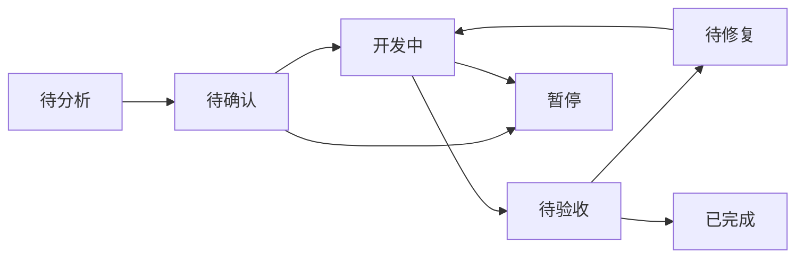

# 模块看板

模块看板用于把一个模块从“准备资料”到“验收完成”的全过程可视化。

项目级看板放在：

```text
08-项目实例/项目名/交付看板.md
```

模块级看板建议放在：

```text
08-项目实例/项目名/模块名/
```

## 文件说明

| 文件 | 用途 |
| --- | --- |
| `模块状态卡片模板.md` | 记录模块当前状态、范围、负责人、下一步 |
| `模块依赖看板模板.md` | 记录模块依赖的接口、页面、组件、数据和外部确认 |
| `开发进度看板模板.md` | 记录每个开发步骤的状态和验收结果 |
| `问题追踪看板模板.md` | 记录模块开发和验收中的全部问题 |

## 推荐模块目录

```text
模块名/
  模块状态卡片.md
  模块资料包.md
  模块依赖图.md
  模块依赖看板.md
  接口能力矩阵.md
  开发步骤卡片.md
  开发进度看板.md
  测试验收.md
  问题追踪看板.md
  规则沉淀.md
```

## 状态流转



## 使用原则

- 项目级看板只看模块整体状态。
- 模块级看板记录细节。
- 依赖问题不要散在聊天里，统一进入依赖看板或问题追踪看板。
- P0 问题必须在模块状态卡片里标出来。
- 第一次开发完成后，按 `10-测试修复闭环` 执行测试和二次修复。
- 模块完成后，把可复用经验沉淀到规则沉淀文件。
