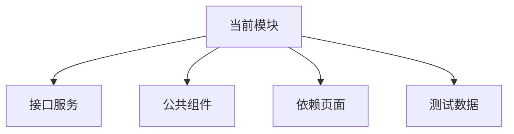

# 模块依赖看板模板

> 用途：把模块依赖的接口、页面、组件、数据和人工确认事项提前看清楚。

## 1. 依赖总览

| 依赖 | 类型 | 是否必需 | 状态 | 影响 | 处理方式 |
| --- | --- | --- | --- | --- | --- |
|  | 接口/页面/组件/数据/权限/配置 | 是/否 | 未确认/可用/不可用/待修复 |  |  |

## 2. 接口依赖

| 能力 | 接口 | 方法 | 文档状态 | 联调状态 | 风险 |
| --- | --- | --- | --- | --- | --- |
|  |  | GET/POST/PUT/DELETE | 已定义/未定义/冲突 | 未联调/通过/失败 |  |

### 接口缺口

| 缺口 | 影响功能 | 等级 | 是否继续开发 | 需要谁确认 |
| --- | --- | --- | --- | --- |
|  |  | P0/P1/P2 | 是/否 |  |

## 3. 页面依赖

| 当前模块 | 依赖页面 | 依赖原因 | 是否必须先完成 | 替代方案 |
| --- | --- | --- | --- | --- |
|  |  |  | 是/否 |  |

示例：

- 客户详情依赖客户列表入口。
- 文件下载依赖文件上传模块生成 file object。
- 代理商停用依赖后端检查跟进中商机。

## 4. 组件依赖

| 组件 | 来源 | 是否已有 | 复用方式 | 是否需要抽象 |
| --- | --- | --- | --- | --- |
| 表格 |  |  |  |  |
| 筛选栏 |  |  |  |  |
| 弹窗 |  |  |  |  |
| 表单 |  |  |  |  |
| 区域选择 |  |  |  |  |

## 5. 数据依赖

| 数据 | 来源 | 用途 | 是否有测试数据 | 风险 |
| --- | --- | --- | --- | --- |
|  |  |  | 是/否 |  |

## 6. 依赖关系图

## 7. 人工确认项

| 问题 | 责任方 | 等级 | 截止时间 | 结果 |
| --- | --- | --- | --- | --- |
|  | 产品/后端/设计/测试 | P0/P1/P2 |  |  |

