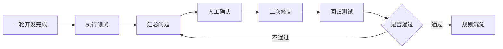

# 测试修复闭环

这个目录用于把“第一次开发完成后的测试、问题整理、人工确认、二次修复、回归验收”串成闭环。

它解决的问题是：AI 第一次写完大概率不完美，不能把问题散落在聊天记录里，也不能让 AI 带着未确认问题反复猜。

## 闭环流程

## 文件说明

| 文件 | 用途 |
| --- | --- |
| `测试执行说明.md` | 告诉 AI 和人工怎么测，不只跑命令，也要点页面、看接口、看样式 |
| `问题汇总模板.md` | 把测试结果汇总成可处理的问题列表 |
| `人工确认清单.md` | 把需要产品、后端、设计、测试确认的问题单独列出来 |
| `二次修复启动提示词.md` | 人工确认后复制给 AI，启动修复 |

## 使用时机

以下情况必须进入本闭环：

- 一个开发步骤完成后，需要局部验收。
- 一个模块第一轮开发完成后，需要整体验收。
- 测试发现 P0/P1 问题。
- 人工已经确认问题，需要 AI 进行二次修复。
- 修复完成，需要回归测试和规则沉淀。

## 关键原则

- 测试失败不是结束，而是进入问题汇总。
- P0 问题必须人工确认后再修。
- P1 问题可以先记录，但不能消失。
- 二次修复必须基于问题清单，不重新猜需求。
- 回归通过后，把复用经验沉淀为规则。
- 通用经验沉淀到 `11-规则库`，项目特殊经验沉淀到项目实例目录。
