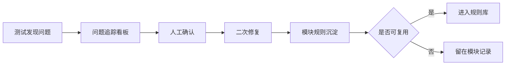

# 规则库

规则库用于沉淀跨项目、跨模块可复用的交付规则。

模块里的问题和经验先记录在模块问题卡片、规则沉淀文件里。如果这条经验以后还会重复出现，就抽到规则库。

## 规则分级

| 级别 | 含义 | AI 是否必须遵守 |
| --- | --- | --- |
| 强规则 | 不遵守会导致业务错误、接口错误、性能问题或代码失控 | 必须遵守 |
| 建议规则 | 大多数企业级项目推荐采用，但可按项目情况调整 | 默认遵守 |
| 项目特有规则 | 只对某一个项目或团队生效 | 只在对应项目遵守 |

## 目录说明

| 文件 | 用途 |
| --- | --- |
| `接口规则.md` | 接口路径、参数、响应、分页、错误处理规则 |
| `样式规则.md` | Demo、设计图、旧项目、组件库的优先级和对齐规则 |
| `性能规则.md` | 列表、搜索、刷新、重复请求等性能规则 |
| `AI写代码规则.md` | 系统 AI 和写代码 AI 的职责边界、分段调度和写代码规则 |
| `项目差异规则.md` | 多项目复用时，如何处理项目差异和局部规则 |

## 使用方式

AI 在开始一个真实模块前，必须先读取：

```text
11-规则库/README.md
11-规则库/接口规则.md
11-规则库/样式规则.md
11-规则库/性能规则.md
11-规则库/AI写代码规则.md
11-规则库/项目差异规则.md
```

系统 AI 必须读取完整规则库后再生成 design 和任务队列。写代码 AI 至少必须读取当前任务 prompt 中指定的规则，不允许拿完整执行包一次性写完整模块。

如果项目实例目录里有项目特有规则，以项目特有规则补充通用规则；如果项目特有规则和通用强规则冲突，必须先人工确认。

## 沉淀流程



## 不应该沉淀的内容

- 只出现一次、且没有复用价值的临时问题。
- 某个测试环境临时不可用。
- 还没有人工确认的猜测。
- 和项目无关的泛泛规范。

## 应该沉淀的内容

- AI 重复犯的错误。
- 接口文档、旧项目、Demo 容易冲突的地方。
- 性能上容易偷懒的写法。
- 多个模块都会用到的组件、样式、交互规则。
- 需要后续项目继续遵守的工程边界。
